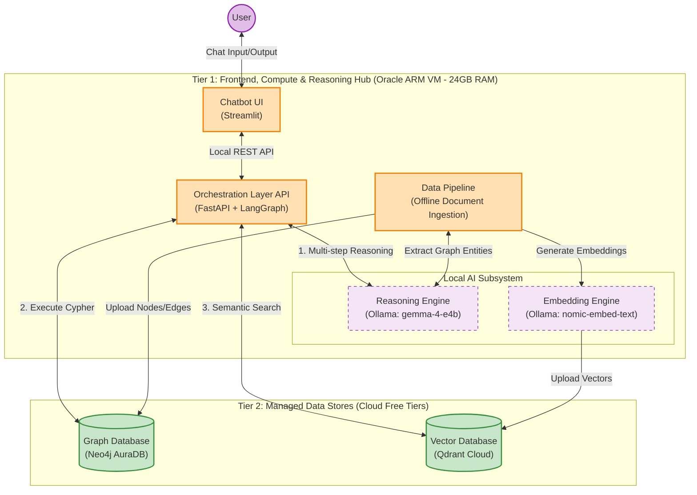

# Agentic RAG Architecture

This document outlines the 100% free deployment architecture for the Agentic RAG chatbot. Since the project is geared towards learning and research, the system simplifies the infrastructure by hosting both the frontend UI and the self-hosted reasoning hub on a single centralized Oracle VM, while continuing to offload state to managed cloud databases.

## System Diagram

